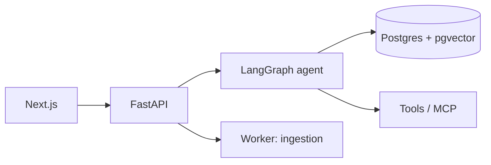

# upgrade-planner

An agentic planning assistant for hardware upgrades. Give it your printer, current hardware,
budget, and skill level; it plans a Klipper conversion with compatible parts, a wiring and
config checklist, safety risks, and a source for every claim.

**Status: early work in progress — nothing runs yet.** [Architecture](#architecture) · [Decisions](docs/adr/)

<!-- TODO: live demo link + CI/license badges once they exist -->

---

## What it does

<!-- TODO: screenshot/GIF above the fold once there's a UI — worth more than any paragraph -->

The intended behaviour. Ask for an upgrade, answer a few clarifying questions, get a staged plan:

- Compatible parts, and rejected options **with the reason** they were rejected
- Bill of materials
- Wiring + `printer.cfg` checklist
- Risk register, conservative about anything mains-powered
- Citations on every claim, or an explicit "assumption" label

## Architecture

The planned shape. <!-- TODO: one paragraph — what crosses which boundary and why, max five sentences -->

## Run it

Not yet — there's no application to run. The target is a single `docker compose up`
with Docker and an OpenAI-compatible API key as the only prerequisites.

## Planned approach

None of this is built yet. Each line gets a link to the code and an ADR as it lands.
<!-- TODO: rename this section to "How it works" once the bullets point at real code -->

- **Retrieval** — hybrid search + reranking, not naive top-k
- **Agent** — LangGraph state machine with a human-in-the-loop checkpoint
- **Tools** — one served over MCP, the rest in-process
- **Ingestion** — background job, so a slow PDF never blocks a request
- **Evals** — golden set of real upgrades, run as a CI gate

## Corpus

Deliberately small: Klipper docs, 3–5 boards, and the parts in my own build.
`corpus/sources.yaml` will be the manifest; `corpus/compatibility.yaml` is hand-written.
Third-party manuals are **not** redistributed here — `scripts/fetch_corpus.py` pulls them
into a gitignored `corpus/raw/` under their own licenses.

## Safety

This plans work involving mains AC, heaters, PSUs, and firmware flashing. The agent is
designed to cite its sources, ask before finalising, and defer to the manual and a multimeter.
It is a planning aid, not an authority. Verify before you wire anything.

## Limitations

<!-- TODO: fill from the eval runs — include the bad numbers, that's the point of this section -->

Too early to have honest numbers here. They go in once the eval set runs.

## Roadmap

- [ ] FastAPI + pgvector skeleton, corpus frozen
- [ ] Retrieval with citations
- [ ] Deployed
- [ ] LangGraph agent + HITL
- [ ] Tools + MCP
- [ ] Hybrid search + reranking, background ingestion
- [ ] Tracing, evals, CI
- [ ] Hardening + streaming UI

## License

Apache-2.0. See [LICENSE](LICENSE). Corpus documents remain under their own licenses.
