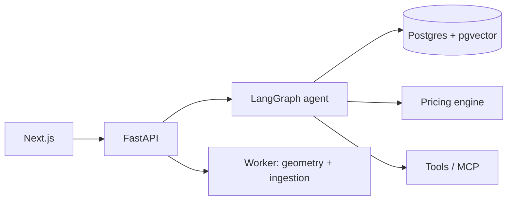

# partquote

An agentic quoting assistant for 3D-printing service bureaus. A bureau configures its machines,
materials and pricing rules; a customer uploads part files and gets a quote — per-part price,
lead time, manufacturability findings, and a cited reason for the recommended material — then
confirms and places the order.

**Status: early work in progress — nothing runs yet.** [Architecture](#architecture) · [Decisions](docs/adr/)

<!-- TODO: live demo link + CI/license badges once they exist -->

---

## What it does

<!-- TODO: screenshot/GIF above the fold once there's a UI — worth more than any paragraph -->

The intended behaviour. Upload STLs, answer a couple of clarifying questions, get a quote:

- Per-part price and lead time, itemised — material, machine time, setup, finishing
- DFM findings: thin walls, oversize parts, non-watertight meshes, risky overhangs
- Material and process recommendation, **with the datasheet or policy line it came from**
- Confirmation step before any order is created

## The rule this project is built around

**The LLM never computes the price.** Pricing is deterministic Python over the bureau's configured
rates. The model handles intake, clarification, manufacturability narrative, material
recommendation and the quote copy. Every figure traces to the pricing engine.

## Architecture

The planned shape. <!-- TODO: one paragraph — what crosses which boundary and why, max five sentences -->

## Run it

Not yet — there's no application to run. The target is a single `docker compose up`
with Docker and an OpenAI-compatible API key as the only prerequisites.

## Planned approach

None of this is built yet. Each line gets a link to the code and an ADR as it lands.
<!-- TODO: rename this section to "How it works" once the bullets point at real code -->

- **Retrieval** — hybrid search + reranking with tenant/material filtering, not naive top-k
- **Agent** — LangGraph state machine, human in the loop to clarify and to confirm the order
- **Geometry** — `trimesh` in a worker: volume, bounding box, watertightness, DFM heuristics
- **Tools** — one served over MCP, the rest in-process
- **Ingestion** — background job, so a slow datasheet never blocks a request
- **Evals** — golden set of parts with known-correct quotes, run as a CI gate

## Corpus

Deliberately small: material datasheets, spec sheets for a handful of printers, the bureau's own
pricing and DFM policy documents, and a few past quotes. Third-party datasheets are **not**
redistributed here — `scripts/fetch_corpus.py` pulls them into a gitignored `corpus/raw/` under
their own licenses.

## Trust and safety

A quote is a commercial commitment, and part files come from strangers. The agent is designed so
that no price originates in the model, no order is created without explicit confirmation, and
nothing inside an uploaded file — filename, header, embedded metadata — can steer a tool call.
Verify a quote against your own rates before you send it to a customer.

## Limitations

<!-- TODO: fill from the eval runs — include the bad numbers, that's the point of this section -->

Too early to have honest numbers here. They go in once the eval set runs.

## Roadmap

- [ ] FastAPI + pgvector skeleton, corpus frozen
- [ ] STL parse + deterministic pricing engine
- [ ] Retrieval with citations
- [ ] Deployed
- [ ] LangGraph agent + HITL on clarify and order
- [ ] Tools + MCP
- [ ] Hybrid search + reranking, background ingestion
- [ ] Tracing, evals, CI
- [ ] Hardening + streaming UI

## License

Apache-2.0. See [LICENSE](LICENSE). Corpus documents remain under their own licenses.
